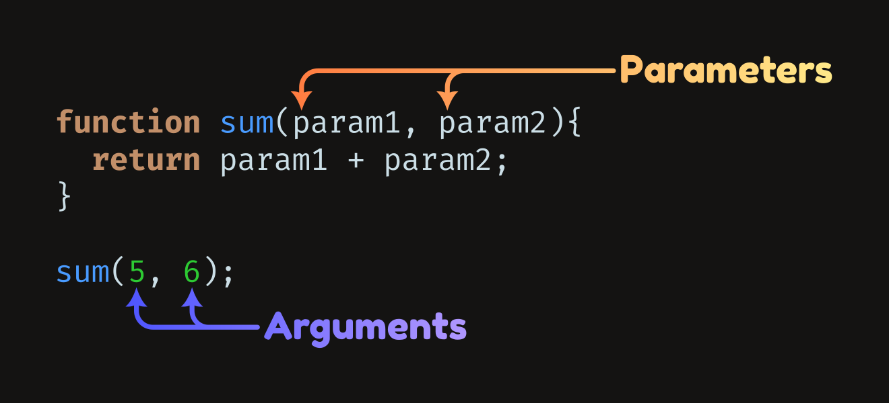

JS-function-array
-----


# **Function**

A Function is a block of code that performs a specific task. And javascript has huge inbuilt functions.

In javascript function is defined with the `function` keyword. The basic rules of naming a function are similar to naming a variable. The body of function is written within `{}`.

Declare a function

```js
// declaring a function named greet()
function greet() {
  console.log("Hello there");
}
```

Calling a Function

To call above declared function named `greet()`. We just have to called it.

```js
// function call
greet();
```

Example:

```js
// program to print a text
// declaring a function
function greet() {
  console.log("Hello there!");
}

// calling the function
greet();
```

### **Parameter And Argument**

A parameter is a variable in the declaration of the function.

An argument is the actual value of the variable that gets passed to the function.



### **Callback Function**

A callback function can run after another function has finished
we can pass functions as parameters to other functions and call them inside the outer functions.

```js
function scriptRunning(callback) {
  console.log("Running the Script...");
  // Using setTimeout to simulate an asynchronous operation
  setTimeout(function () {
    callback("Operation Done");
  }, 2000);
}

// Defining callback function
function recallFunction(result) {
  console.log("Result: " + result);
}

// Call the main function with the callback function
mainFunction(recallFunction);
```

**Output**

```
Running the Script...
Result: Operation Done

```

# **Array**

An array in JavaScript is a type of global object that is used to store data. Arrays consist of an ordered collection or list containing zero or more data types, and use numbered indices starting from `0` to access specific items.

Arrays are very useful as they store multiple values in a single variable, which can condense and organize our code, making it more readable and maintainable. Arrays can contain any data type, including numbers, strings, and objects.

### **Demonstrate array usefulness**

```js
// Assign the five country to five variables
const country1 = "Bangladesh";
const country2 = "India";
const country3 = "Nepal";
const country4 = "Pakistan";
const country5 = "Bhutan";
```

Above method is very difficult to maintain. But with help of `array` data can be manage simple way.

```js
// Assign the five country
let countrys = ["Bangladesh", "India", "Nepal", "Pakistan", "Bhutan"];

countrys[0];
```

**Output**

```
Bangladesh

```

### **Accessing Item in Array**

An item in a JavaScript array is accessed by referring to the index number of the item in square brackets.

```js
countrys[3];
```

**Output**

```
Nepal

```

### **Adding Item in Array**

We can add new value to our above `countrys` variable.

```js
countrys[5] = "Sri Lanka";

countrys;
```

**Output**

```
 ['Bangladesh', 'India', 'Nepal', 'Pakistan', 'Bhutan', 'Sri Lanka']

```

### **Array.push**

To avoiding `undefined` item. `push()` method can be used.

```js
// Append Maldives to the end of the countrys array
countrys.push("Maldives");

countrys;
```

**Output**

```
 ['Bangladesh', 'India', 'Nepal', 'Pakistan', 'Bhutan', 'Sri Lanka', 'Maldives']

```


### **Array.splice**

The `splice()` method changes the contents of an array by removing or replacing existing elements and/or adding new elements in place.

```js
countrys.splice(1, 7);
countrys.splice(7, 0, "NEW Nation");

countrys;
```

**Output**

```
 ['Bangladesh']
 ['Bangladesh', 'India', 'Nepal', 'Pakistan', 'Bhutan', 'NEW Nation']

```
### **Array.slice**

The `slice()` method returns a shallow copy of a portion of an array into a new array object selected from start to end (end not included) where start and end represent the index of items in that array. The original array will not be modified.

```js
countrys.slice(1);
```

**Output**

```
 ['India', 'Nepal', 'Pakistan', 'Bhutan']

```

### **Array.pop**

The `pop()` method will remove the last item in an array.

```js
countrys.pop();
```

**Output**

```
 Bhutan

```


### **Array.fill**

The `fill()` method returns an array by filling all elements with a specified value.


```js
// defining an array 
var fruits = ['Apple', 'Banana', 'Grape'];

// filling every element of the array with 'Cherry'
fruits.fill("Cherry");

console.log(fruits);

```

**Output**

```
 [ 'Cherry', 'Cherry', 'Cherry' ]

```


### **Array.length**

The `length` property returns or sets the number of elements in an array.

```js
// find the length of the country array
let len = countrys.length;


console.log("length:", len);

```

**Output**

```
length: 4

```


### **Looping Array**

We can `loop` through the entirety of the array with the for keyword, taking advantage of the length property.


```js
// Loop through the length of the array
for (let i = 0; i < countrys.length; i++) {
  console.log(i, countrys[i]);
}
```

**Output**

```
0 'Bangladesh'
1 'India'
2 'Nepal'
3 'Pakistan'
4 'Bhutan'

```

We can also use the `for...of` loop

```js
// Loop through each country
for (let country of countrys) {
	console.log(country);
}
```

**Output**

```
Bangladesh
India
Nepal
Pakistan
Bhutan

```

### **Callback with Array.forEach**

```JS
// Define an array of numbers
var numbers = [1, 2, 3, 4, 5];

// Define the main function
function mainFunction(callback) {
console.log("Performing operation...");
// Use Array.forEach to loop through the array of numbers
numbers.forEach(callback);
}

// Define the callback function
function callbackFunction(number) {
console.log("Result: " + number);
}

// Call the main function with the callback function
mainFunction(callbackFunction);


```

**Output**

```
Performing operation...
Result: 1
Result: 2
Result: 3
Result: 4
Result: 5

```

